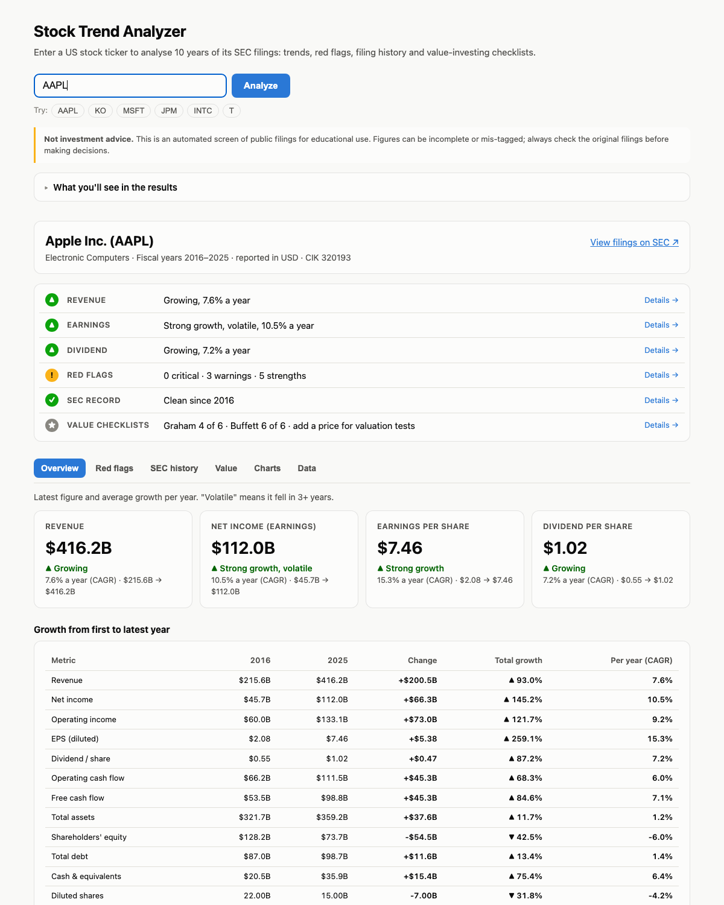

# 10-Year Stock Value Analysis

[](https://github.com/dipak-nehe/stock-trend-analyzer/actions/workflows/tests.yml)

**Live site: [stock-value-analysis.vercel.app](https://stock-value-analysis.vercel.app/)** · try [AAPL](https://stock-value-analysis.vercel.app/?t=AAPL), [KO](https://stock-value-analysis.vercel.app/?t=KO), [SMCI](https://stock-value-analysis.vercel.app/?t=SMCI)

Type a stock ticker and get 10 years of revenue, earnings, and dividend trends, plus an automated check of the balance sheet and cash flows for red flags. All data comes from the company's own annual filings through the free **SEC EDGAR** API.



## Features

- **At a glance, then tabs.** Results open with six one-line verdicts (revenue, earnings, dividend, red flags, SEC record, value checklists). The detail sits in tabs: Overview, Red flags, SEC history, Graham & Buffett, Charts and Data. Each tab ends with Previous/Next buttons, the landing-page guide is organised by the same tabs, and the link remembers the tab, e.g. `?t=SMCI#flags`.
- **10-year trends** for revenue, net income, EPS, and dividend per share, with CAGR and a trend label (growing, flat, declining, volatile).
- **Red-flag engine** that grades 20+ checks as *critical*, *warning*, or *strength*:
  - Growth: shrinking or inconsistent revenue, margin compression, falling EPS
  - Profitability: recent or past net losses
  - Leverage and liquidity: debt/equity, debt growing faster than revenue, current ratio, interest coverage, negative equity, large goodwill
  - Earnings quality: operating cash flow below net income, negative free cash flow, receivables or inventory growing faster than sales
  - Shareholders: dilution vs buybacks, dividend cuts or suspension, payout above 100%, dividends not covered by free cash flow
- **SEC filing history** from the company's EDGAR record: restatement warnings (8-K item 4.02), auditor changes (8-K item 4.01), late-filing notices (NT 10-K / NT 10-Q), other serious 8-K events (bankruptcy 1.03, stock-exchange delisting notices 3.01, material cybersecurity incidents 1.05, large write-downs 2.06), completed acquisitions or sales (2.01, for context), amended annual reports, and SEC staff comment letters with the company's replies. Routine 8-K items such as officer and pay changes (5.02) are left out on purpose: they're filed dozens of times a year. Each entry is described in plain English with the SEC's official item title underneath, word for word (e.g. *8-K item 4.02: Non-Reliance on Previously Issued Financial Statements…*), links to the original document, and the serious ones also feed the red flags. Wording never goes beyond the filing: a 4.02 notice is a *restatement warning*, since the filing says the old numbers shouldn't be relied on, not that they've been restated yet.
- **Value investing checklists** that score the company against Benjamin Graham's defensive-investor criteria (*The Intelligent Investor*, ch. 14: size, current ratio, debt vs working capital, earnings stability, dividend record, EPS growth, P/E, P/B) and Buffett-style business-quality tests (consistent earnings, ROE, debt vs earnings, margins, capital needs, buybacks, margin of safety). The page also shows the Graham Number and a simple owner-earnings (free cash flow) value estimate. Enter an optional share price to run the valuation tests; it's kept in the URL (`?t=KO&p=68`). The site doesn't fetch prices itself (free price feeds such as Finnhub are licensed for personal use only), so the price box links to Google and Yahoo Finance for a quick look-up. Results are shown as criteria met or not met, never as buy/sell ratings.
- **Growth over the period** table: first year vs latest year for revenue, earnings, EPS, dividends, cash flow, balance-sheet items and share count, with the change, total % growth and per-year growth (CAGR). Sign changes such as "from profit to loss" are spelled out.
- **Plain-English explanations:** every red flag says why it matters; flags are grouped into *Needs attention*, *Going well* and *Notes*; jargon has hover definitions and a "Terms explained" glossary; trend tiles show a 10-year sparkline; tables are grouped by statement with the latest year highlighted.
- **English and Spanish (Spain).** An EN | ES switch sits in the header. Spanish browsers get Spanish automatically, the choice is remembered, and it's kept in the link (`?lang=es`). Numbers follow Spain's conventions (416,2 mil M US$, 7,6 %, PER, BPA). All text lives in `public/js/strings/`, and tests check that every English string has a Spanish version with the same placeholders.
- **Compare two stocks.** After a result, *Compare with another stock →* opens `compare.html` with the first company already loaded; enter a second ticker and both are analysed exactly as on their own pages. The comparison shows the at-a-glance verdicts side by side, a key-figures table (growth, margins, balance sheet, shareholder measures, red-flag counts, checklist scores), revenue and EPS growth indexed to 100 in the first common year, each company's *needs attention* points and the full Graham & Buffett grid. A small ● marks the more favourable value only where the direction is clear-cut (e.g. lower debt/equity); sizes get no mark and there is no overall winner. Optional prices per stock add valuation rows. Everything is kept in the link (`compare.html?a=KO&b=PEP&pa=68`), with swap, per-side errors and notes when currencies or fiscal year-ends differ.
- **Eight charts** (Chart.js) and a full data table, in light and dark mode.
- **Stock-split adjustment.** EDGAR never restates old per-share values, so the server detects splits from restated EPS in later filings and adjusts older EPS, dividends, and share counts.
- **Handles banks and insurers.** Leverage and liquidity rules that don't apply to them are skipped.
- **Foreign filers** (20-F / 40-F, IFRS) are pinned to their reporting currency, so USD convenience translations are never mixed in.

## Stored results

Each ticker is fetched from SEC once, and the finished result is stored and reused (`backend/store.py`):

- **Fresh for 24 hours:** repeat lookups are served from storage (a few milliseconds instead of 1–3 s) without calling SEC.
- **After 24 hours, a cheap re-check:** only the company's filing list is downloaded (about 0.5 MB instead of about 6 MB for Microsoft). If no new annual or quarterly report (10-K, 10-Q, 20-F, 40-F or an amendment) has been filed, the stored figures are kept and only the SEC filing history is refreshed, so new red flags such as late filings still appear within a day (`X-Data-Cache: REVALIDATED`).
- **A new annual or quarterly report** triggers a full refresh. So do stored figures more than 90 days old, as a safety net.
- **If SEC is unreachable,** the saved copy is shown with a notice instead of an error.
- **The ticker lookup table** is stored for a week, instead of downloading SEC's multi-MB list each time.
- **Stored data is gzip-compressed** (a company is about 2–15 KB) and keyed with a format version (`CACHE_VERSION`), so a format change never serves old-shaped data.

| Where | Storage |
|---|---|
| Live site with Upstash Redis connected (Vercel → Storage) | Redis, shared by all servers |
| Live site without Redis | In memory, per server instance |
| Your machine | Files in `.cache/` (set `STOCK_CACHE=off` to disable) |

Responses carry `X-Data-Cache: HIT | REVALIDATED | MISS | STALE` and `X-Data-Store: redis | memory | file`, and the page shows "Data from SEC as of …".

## Keeping it healthy

- **Live-site check:** a scheduled GitHub Action (`.github/workflows/health.yml`) loads both pages and asks the API for a fresh answer every 6 hours. If anything fails, GitHub emails the repo owner. It can also be run by hand from the Actions tab.
- **Dependency updates:** Dependabot opens one grouped pull request per week for each of Python, npm and GitHub Actions. CI runs the full test suite on each, so an update is merged only when everything passes.

## Privacy

The live site counts visits with [Vercel Web Analytics](https://vercel.com/docs/analytics): page views, country, device and referrer, with no cookies and no personal data. It isn't loaded when running locally, and the footer says so.

## Run it locally

Requires Python 3.9+. It has no third-party dependencies.

```bash
export SEC_USER_AGENT="StockTrendAnalyzer your-email@example.com"   # required by SEC's fair-access policy
python3 server.py
```

Open <http://localhost:8000>, or link straight to a ticker with `http://localhost:8000/?t=KO`.
To use a different port, run `PORT=8001 python3 server.py`.

## Deploy to Vercel (free)

1. Sign in at [vercel.com](https://vercel.com) with GitHub, click **Add New → Project**, and import this repo.
2. Leave the framework preset as **Other**. No build command is needed.
3. Under **Environment Variables**, add `SEC_USER_AGENT` = `StockTrendAnalyzer your-email@example.com`.
4. Click **Deploy**. Every push to `main` redeploys automatically.

API responses are cached on Vercel's CDN for a day (`s-maxage=86400`), so repeat lookups never reach SEC.

## Tests

316 automated tests run on every push (GitHub Actions). They never call SEC: they use trimmed real filings saved in `tests/fixtures/`, so they're fast, offline and repeatable.

| Layer | What it covers |
|---|---|
| **Unit** (`tests/test_stock_data.py`, `tests/test_store.py`, 86 tests) | Hand-built filings for the tricky rules: restated values, stock splits (forward and reverse), foreign currency, liabilities with minority interest, debt when tags change between years, dividend fallbacks, filing classification, input validation, error handling, cache headers |
| **Regression** (`tests/test_regression.py`, 47 tests) | Real Apple, Coca-Cola, Intel, JPMorgan and Super Micro filings. Figures are pinned to values cross-checked against published financials for fiscal 2021–2025. |
| **HTTP** (`tests/test_server.py`, 24 tests) | Local server and Vercel function give identical responses. Source files can't be downloaded. Bad input is rejected. |
| **JavaScript unit** (`tests/js/`, 65 tests) | The browser-side logic, run in Node with no dependencies: formatting, CAGR and trend labels, every red-flag rule, the Graham/Buffett checklists and value estimate, the growth table and filing-history views, and the comparison rules (mark directions, bank and negative-equity n/a, indexed growth, caveats) |
| **End-to-end** (`e2e/ui.spec.ts` and `compare.spec.ts`, 82 tests) | [Playwright Test](https://playwright.dev) in TypeScript drives the real page in Chromium, against the real Python server running on the saved filings (`tests/e2e_server.py`, started by `playwright.config.ts`): the results guide, the at-a-glance card and tabs (including keyboard navigation and links to a tab), search, a tour of every tab (each opens alone, updates the address and shows its content), charts, red flags, filing-history filters, price-based valuation, bank handling, errors (shown right under the search box, and a wrong ticker never leaves the previous company in the address), disclaimer, phone layout, and no JavaScript errors. `e2e/compare.spec.ts` (15 tests) covers the compare page: the link appearing only after a result, the first stock pre-loaded, loading the second, marks, prices, swap, deep links, same-ticker and unknown-ticker errors, language carry-over and phone width. |
| **Accessibility** (`e2e/accessibility.spec.ts`, 31 tests) | axe-core (`@axe-core/playwright`) checks against WCAG 2.0/2.1/2.2 A and AA plus best practices, on the landing page, every results tab and the compare page, in light and dark mode, English and Spanish, and desktop and phone width. Keyboard-only checks cover search, the tabs, the At a glance lines and scrolling the wide tables. |

```bash
python3 -m venv .venv
.venv/bin/pip install -r requirements-dev.txt
npm install
npx playwright install chromium

.venv/bin/pytest                 # unit, regression and HTTP tests (Python backend), about 2 seconds
node --test tests/js/*.test.js   # JavaScript unit tests (Node 20+)
npm run test:e2e                 # browser and accessibility tests (Playwright, TypeScript), about 30 seconds
npm run test:e2e:ui              # the same in Playwright's interactive UI mode
```

**Page objects and locators.** Every element the browser tests use is defined once, in `e2e/pages/` (`BasePage` for the header, disclaimer and footer; `AnalysisPage` for the start and results page; `ComparePage` for the compare page). The specs only call those classes. Locators follow Playwright's recommended order: `getByRole` → `getByText` → `getByLabel` → `getByPlaceholder` → `getByTitle` → `getByTestId` → CSS, never XPath. Controls people use (search box, buttons, tabs, links, language switch) are found by role or label, which also proves they're real, correctly named buttons, tabs and labelled fields; names match English or Spanish (`e2e/pages/names.ts`), so one page object serves both languages. Content the tests read (company name, tiles, tables, flags, checklists) is found by `data-testid`. When a control's name is only incidental hard-coded text (an arrow, a count, a hidden `aria-label`), its `#id` is used instead, e.g. `#compareLink`, `#swap`, `#historyMore`. The remaining CSS is for decorative parts with no role (icons, sparklines, the ● mark). Every non-role locator carries a comment saying why.

The backend tests stay in pytest because they test Python code directly; the browser tests are TypeScript, like the Android app's end-to-end suite. `npm run typecheck` checks them in strict mode (with unused variables as errors, since typescript-eslint doesn't support TypeScript 7 yet).

### Test report (Allure)

**Latest report: https://stock-trend-test-report.vercel.app** (updated on every push to `main`)

Every CI run builds an [Allure](https://allurereport.org) report covering all 335 tests, grouped by layer. **Browser tests can be replayed step by step:** each named step (e.g. *open SMCI with price 30 → open the flags tab → press Home → search for KO*) carries a screenshot of the screen at that point, and page loads and tab changes are captured automatically (`step()` and `snap()` in `e2e/fixtures.ts`). **Every browser test also has a video** of the whole run (Playwright's `video` option at 640×360, attached by allure-playwright); with compressed JPEG screenshots the single-file report stays around 30 MB. Failed browser tests also carry a screenshot at the failure and a Playwright trace, and accessibility failures carry the full axe output. (On failure CI also uploads Playwright's own HTML report as the **playwright-report** artifact.)

- **Finding the screenshots:** open a browser test (groups *4 · End-to-end* and *5 · Accessibility*). Its **Test body** lists only the named steps; expand a step to see its screenshot, or open the test's **Attachments** tab for all of them plus the video. (Playwright's internal calls and assertions are left out with allure-playwright's `detail: false`, so they don't bury the screenshots.)
- **In GitHub:** open the run under **Actions**. The run summary shows the pass count and links. Download the **allure-report** artifact: it's a single `index.html` that opens in any browser.
- **On Vercel:** every push to `main` publishes the latest report to its own site (above), through the Vercel REST API (`.github/scripts/publish_report.py`). This needs a `VERCEL_TOKEN` repository secret with access to the whole account or team; a token limited to specific projects can't create the report site. The link appears in the run summary and the log.
- **Locally:**
  ```bash
  npm install                          # once: installs the Allure CLI (Node only, no Java)
  rm -rf allure-results && npm run test:js:allure && .venv/bin/pytest --alluredir=allure-results && npm run test:e2e
  npm run report                       # writes allure-report/index.html
  ```

### Lint and type check

```bash
npm run lint        # ESLint: recommended rules plus no-shadow, eqeqeq (null-aware), prefer-const
npm run lint:py     # Ruff lints the Python (pyflakes, pycodestyle, import order, bugbear, pyupgrade); settings in ruff.toml
npm run typecheck   # TypeScript 7 checks the plain JavaScript (checkJs); no build step, nothing emitted
npm run check       # all three; CI runs this before the tests
```

The code stays plain JavaScript: JSDoc hints (`/** @type {...} */`) cover the few places where types aren't obvious, and `types/globals.d.ts` declares the globals loaded by `<script>` tags (Chart.js, Vercel Analytics).

To refresh the saved filings, run `SEC_USER_AGENT="App you@example.com" python3 tests/make_fixtures.py`. Then update any pinned values that changed.

## Project structure

```
public/index.html     results page; public/compare.html is the compare page
public/styles.css     styles shared by both pages
public/vendor/        Chart.js 4.4.1 (MIT), served from the site so no third-party request can block the page
public/js/strings/    en.js and es.js translations (static page text uses data-i18n keys)
public/js/            ES modules: app.js and compare-app.js wire the two pages (page.js holds
                      what they share; compare.js builds the comparison); flags.js (red-flag rules),
                      valuation.js (Graham/Buffett), growth.js, history.js, views.js and
                      charts.js; format.js, series.js and labels.js hold shared helpers
public/favicon.svg    icon; public/og.png is the link-preview image
api/financials.py     Vercel serverless function: GET /api/financials?ticker=AAPL
backend/stock_data.py SEC EDGAR fetching and normalization, shared by both servers
backend/store.py      stored results: Redis (live), files (local) or memory (tests)
server.py             local development server (same API, serves public/)
vercel.json           function settings and security headers
tests/                unit, regression and HTTP tests (pytest) + saved SEC fixtures + tests/e2e_server.py
e2e/                  Playwright Test browser and accessibility tests (TypeScript); playwright.config.ts at the root
tsconfig.json, eslint.config.js, types/   type checking and lint settings (not deployed)
.github/workflows/    tests.yml runs the checks and tests on every push; health.yml checks the live site every 6 hours
.github/dependabot.yml  weekly grouped update pull requests for Python, npm and GitHub Actions dependencies
```

## How it works

```
Browser (public/index.html) ──/api/financials?ticker=KO──▶ api/financials.py ──▶ SEC EDGAR
   trends, flags,                                         (or server.py locally)
   charts, table   ◀────────── normalized JSON ──────────  stock_data.py: ticker → CIK,
                                                           10-K facts → 10 fiscal years
```

- **`backend/stock_data.py`** (used by `server.py` locally and `api/financials.py` on Vercel) maps the ticker to a CIK and downloads the XBRL *company facts*. For each metric it keeps only full-year values from annual reports and prefers the latest (restated) filing. It falls back through alternative XBRL tags, since companies label revenue and similar items differently. Responses are cached in memory and on the CDN. A small backend is needed because SEC's API doesn't allow direct browser (CORS) requests. The response also carries `latestReport` (the newest 10-K, 10-Q, 20-F or 40-F with its filing date and link), which the [Android app](https://github.com/dipak-nehe/stock-value-android) compares between checks to send "new report filed" alerts.
- **`public/js/`** holds plain-JavaScript ES modules with no build step. The analysis modules are pure functions (data in, results or HTML out), so they're unit-tested in Node. Only `app.js`, `compare-app.js`, `page.js` and `charts.js` touch the page.

## Limitations

- Covers companies that file with the SEC only.
- Some companies don't tag every item (for example, Berkshire Hathaway has no EPS tag). Checks that need missing data are skipped, and the page says so.
- "Total debt" is long-term debt (including the part due within a year) plus short-term borrowings; lease liabilities are not included, so it can be lower than totals on sites that add leases.
- This is an automated screen, **not investment advice**. Check the actual filings before making decisions.

## License

MIT
